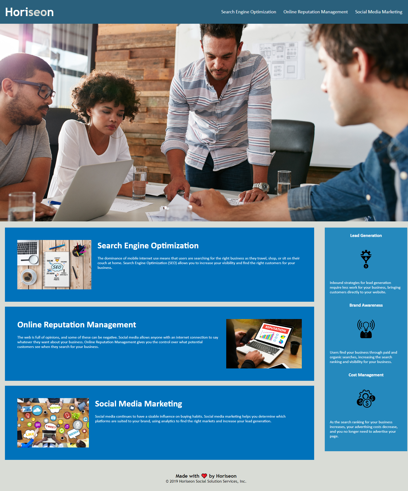

# Horiseon Landing Page

This landing page is designed for viewing form a desktop with a locked header with links, a main image, 3 blocks describing what Horiseon as a company offers, and one side bar under the image which has a few summaries for what Horiseon can do for a customer.

I wanted to create a codebase that follows accessiblity standards and is optimized for search engines that meets the following requirements:
* Uses semantic HTML elements
* Uses logical structures independent of styling and positions
* Uses alt attributes for all images
* heading attributes are in sequential order
* Title elements are concise and descriptive

This project can be viewed by going to [link](https://chrisosbii.github.io/01cbQkMxXw/)

